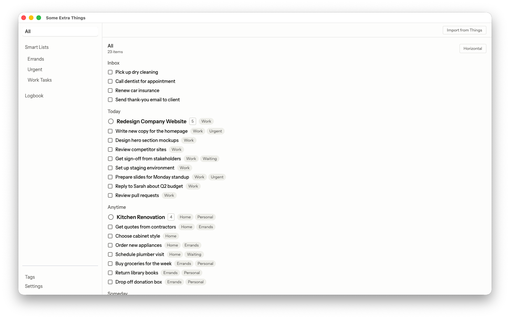
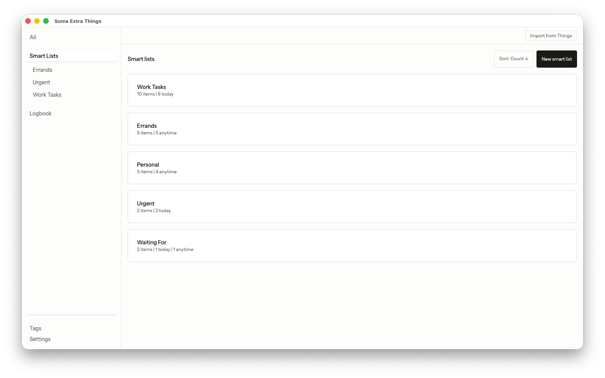
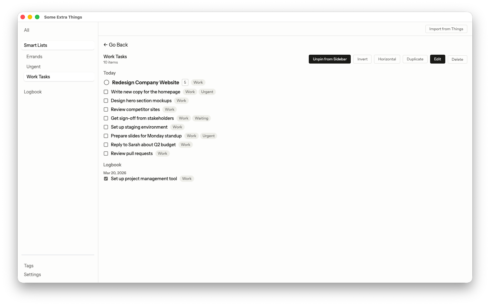
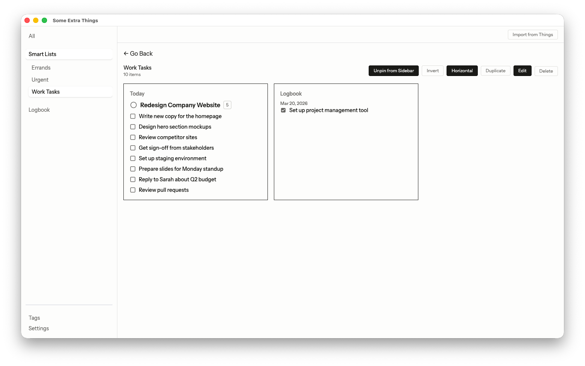
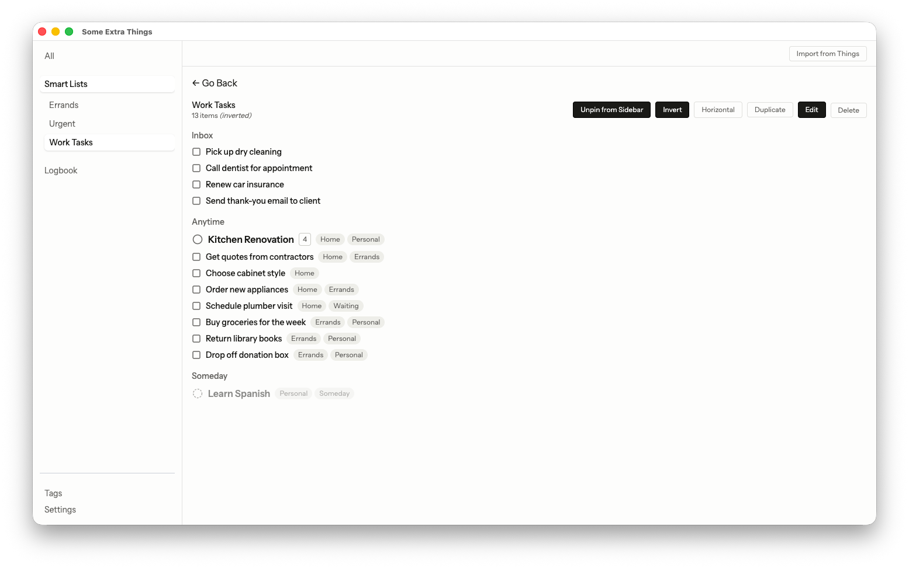
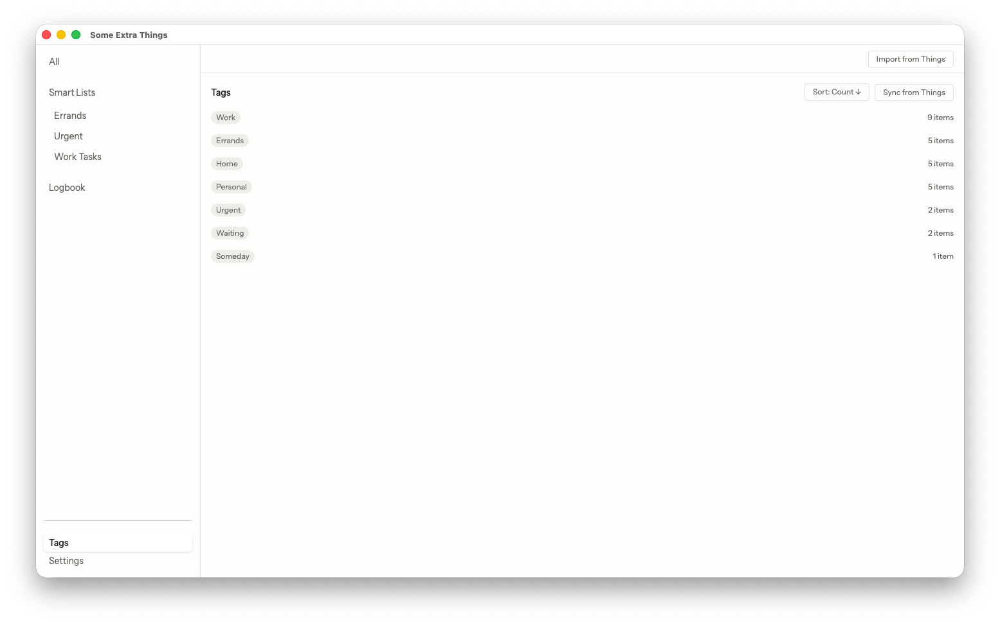
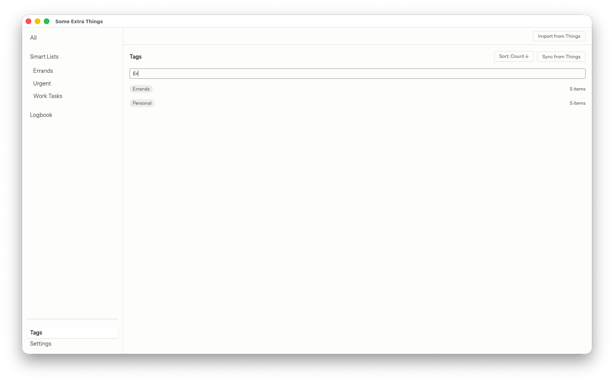
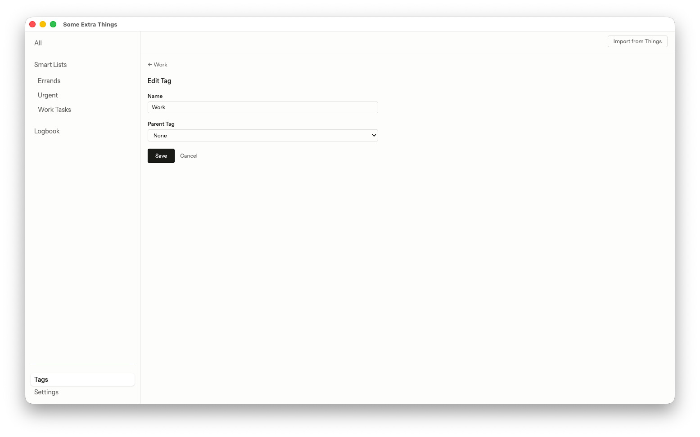

# Some Extra Things

A Mac app for doing a few extra things with [Things 3 (@CulturedCode)](https://culturedcode.com/things/).

This project functions mainly as a flagship for experimenting with how Things 3 can be extended on the desktop. I'm open to ideas like extracting certain functionality into their own apps if the need arises.

For contributions, see [contributing guide](CONTRIBUTIONS.md).

## About

This app is designed to work with your existing Things 3 setup on Mac, while adding a few extra features that are not available, such as:

### All tasks view

> All todos and projects in one screen

### Smart lists (filtering by and against tags)

> Organize todos and projects with smart lists that filter on or against tags (e.g., "get me all work items that aren't at my desk")

> Switch to horizontal view for kanban experience

> Invert the filtering logic to view todos and projects that don't fit into the smart list

### Flat list tag editor with search

> Flattened tags list with search capabilities

> Update tag name and parent back to Things 3 (**note**: this requires enabling in the settings)

## How do I get my Things todos and projects over?

The simplest way to migrate Things todos and projects is to click the "Import From Things" button. It will import most of your unlogged todos and projects (**note**: stuff like project headings will not be included with this method).

For tags, you can get all data by navigating to the "Tags" screen and clicking "Sync From Things". It will import not only your tags but also their parents and unique ids (which are necessary for writing back to Things when editing tags).

### Using Apple Shortcuts (More Advanced)

For a more fine-grained approach, you can use the local API server and send Things items over via an Apple Shortcut.

1. Navigate to settings
2. Generate a token and copy it
3. Create an Apple Shortcut

Here is an example that lets you send selected items over: <https://www.icloud.com/shortcuts/1349327d92c04a25ad5aa71489eaea4b>.

Anytime you trigger the shortcut, any item you have selected will be sent over if the app is running.

> [!NOTE]
> There can be instances when the server's port changes or you need to regenerate tokens.
>
> If you've built multiple shortcuts that talk to Some Extra Things, it would be ideal to centralize your server and api key in their own shortcuts, which return them as output.
>
> Then you use the "Run Shortcut" action whenever you want to call on them in all your shortcuts.
>
> If the server port changes or you regenerate your token, all you have to do is change them in their own shortcut and the change applies to all other shortcuts that use it.
